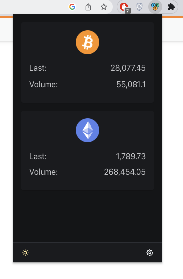

# Exchange Rates
## Simple Chrome Extension

### Installation
To install the Exchange Rates Chrome extension, follow these steps:

1. Install the latest version of Node.js.
2. Clone this repository to your local machine using `git clone https://github.com/algebris/chrome-currencies.git` or by downloading the ZIP file and extracting its contents.
3. Open a terminal or command prompt and navigate to the project directory.
4. Run `pnpm install` to install the project's dependencies.
5. In your Chrome browser, navigate to `chrome://extensions/`.
6. Enable Developer mode by clicking the toggle switch in the upper right corner.
7. Click the "Load unpacked" button and select the `dist/` folder from the project directory.

### Usage
Once the Exchange Rates Chrome extension is installed, you can click on its icon in the browser toolbar to open the popup window. The popup window displays a list of currency pairs with their corresponding volumes and values.

### Tech Stack
Exchange Rates is built using the following technologies:

- React 18.2
- Vite 3.1
- TypeScript 4.8
- React Router Dom
- Effector 22.7

These modern web technologies provide a seamless and responsive user experience, as well as efficient and reliable builds.

### Credits
Exchange Rates was created by [Your Name] as a personal project.

### License
This project is licensed under the [MIT License](LICENSE).
